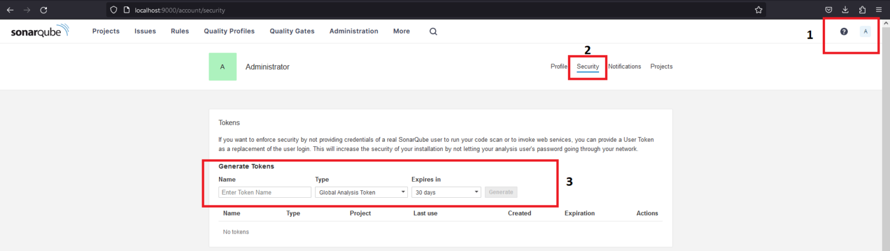
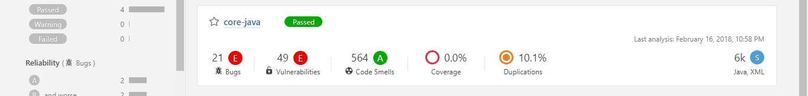
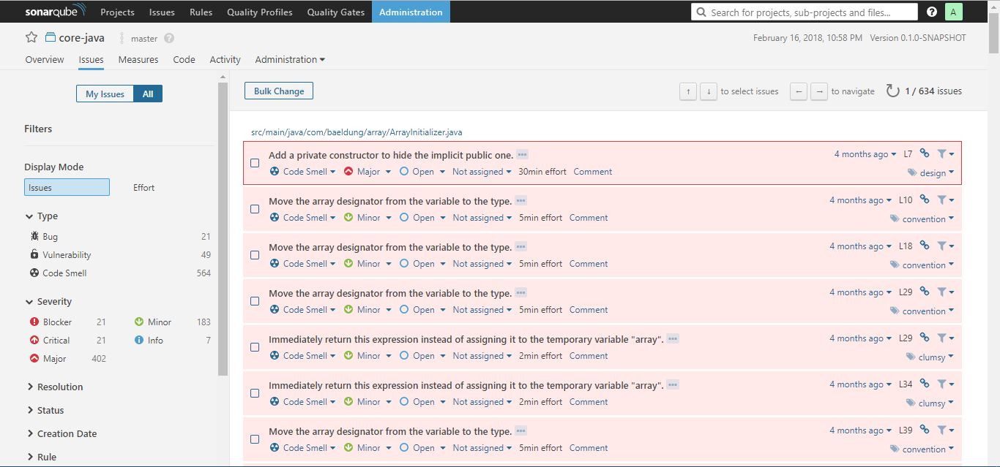
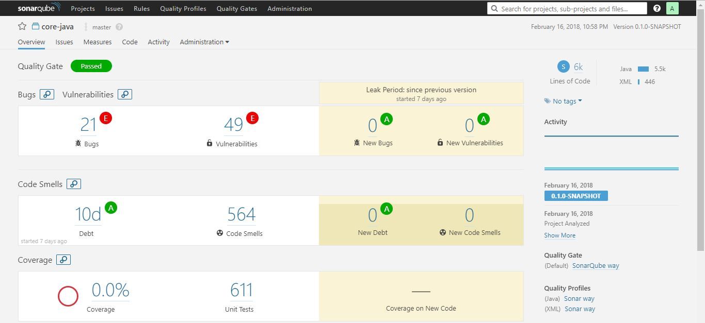
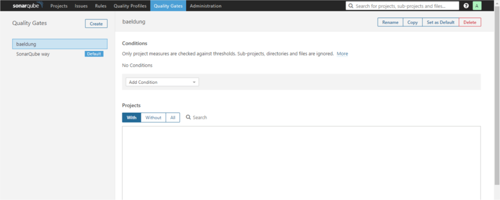
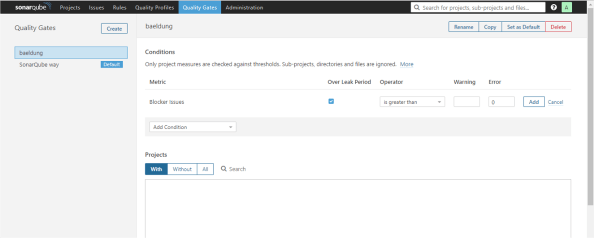
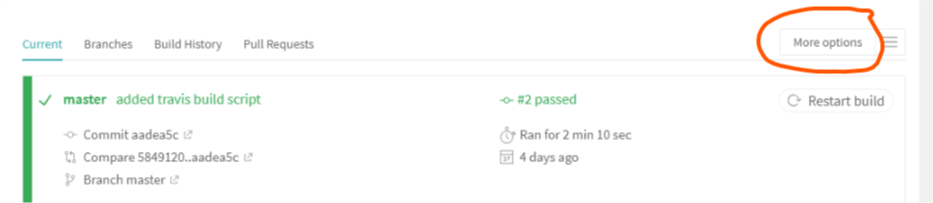

# TP 00 : Premiers pas avec SonarQube

## 1. Vue d'ensemble
   
Dans ce `TP`, nous allons examiner l'analyse statique du code source avec [SonarQube](https://www.sonarqube.org/), qui est une plate-forme `open source` pour garantir la qualité du code.

Commençons par une question centrale : `pourquoi analyser le code source en premier lieu ?` En termes simples, pour garantir la qualité, la fiabilité et la maintenabilité tout au long de la durée de vie du projet ; une base de code mal écrite est toujours plus coûteuse à maintenir.

## 2. Exécuter SonarQube localement

Pour exécuter le serveur `SonarQube` localement vous avez deux possibilités :

- Exécuter le serveur `Sonarqube` à partir d'un fichier `zip`. Pour télécharger la dernière version `LTS` de `SonarQube`, vous pouvez la trouver [ici](https://www.sonarqube.org/downloads/). Configurez votre serveur local comme indiqué dans ce [guide de démarrage rapide](https://docs.sonarqube.org/latest/setup/get-started-2-minutes/).

- Exécuter `Sonarqube` dans un `Conteneur Docker`. Démarrez le serveur en exécutant cette commande :

```bash
docker run -d --name sonarqube -e SONAR_ES_BOOTSTRAP_CHECKS_DISABLE=true -p 9000:9000 sonarqube:latest
```

## 3. Générer un jeton dans SonarQube

Après avoir suivi les étapes précédentes pour démarrer un nouveau serveur `SonarQube`, il est maintenant temps de vous y connecter avec `admin:admin` (ce sont les informations d'identification par défaut initiales, et il vous sera demandé de les modifier).

Pour pouvoir utiliser ce scanner dans votre projet vous devez générer un jeton d'accès depuis l'interface `SonarQube`. Après une connexion réussie, accédez à la page de votre compte (http://localhost:9000/account) et sélectionnez l'onglet `Sécurité (Security)`. À partir de cet onglet, vous pouvez générer trois types de jetons à utiliser dans votre projet :

- `Jeton d'analyse de projet` – cela sera applicable au niveau du projet

- `Jeton d'analyse globale` – celui-ci sera partagé entre tous les projets

- `Jeton utilisateur` – basé sur l'accès au niveau utilisateur, au projet auquel cet utilisateur aura accès.

<div align="center">
  
  <p></p>
</div>

## 4. Analyse du code source

Nous utiliserons le jeton de génération plus tard au moment de l'analyse de notre (nos) projet (s). Nous devons également sélectionner le langage principal (`Java`) et la technologie de build du projet (`Maven`).

Définissons le plugin dans le `pom.xml` :

```xml
<build>
    <pluginManagement>
        <plugins>
            <plugin>
                <groupId>org.sonarsource.scanner.maven</groupId>
                <artifactId>sonar-maven-plugin</artifactId>
                <version>3.4.0.905</version>
            </plugin>
        </plugins>
    </pluginManagement>
</build>
```

La dernière version du plugin est disponible [ici](https://search.maven.org/classic/#search%7Cgav%7C1%7Cg%3A%22org.sonarsource.scanner.maven%22%20AND%20a%3A%22sonar-maven-plugin%22). Maintenant, nous devons exécuter cette commande depuis la racine du répertoire de notre projet pour l'analyser :


```bash
mvn clean verify sonar:sonar -Dsonar.projectKey=PROJECT_KEY 
                             -Dsonar.projectName='PROJECT_NAME' 
                             -Dsonar.host.url=http://localhost:9000 
                             -Dsonar.token=THE_GENERATED_TOKEN
```

Nous devons remplacer `PROJECT_KEY`, `PROJECT_NAME` avec les informations que nous avons définies à l'`étape 3` et le jeton d'accès généré par `SonarQube` fourni précédemment.

Le projet que nous avons utilisé dans ce `TP` est disponible [ici](https://github.com/eugenp/tutorials/tree/master/security-modules/cas/cas-secured-app).

Nous avons spécifié l'`URL hôte` du serveur `SonarQube` et le login (jeton généré) comme paramètres du plugin `Maven`.

Après avoir exécuté la commande, les résultats seront disponibles sur le tableau de bord Projets – à l'adresse http://localhost:9000.

Il existe également d'autres paramètres que nous pouvons transmettre au plugin Maven ou même définir depuis l'interface Web ; `sonar.host.url`, `sonar.projectKey` et `sonar.sources` sont obligatoires tandis que d'autres sont facultatifs.

Les autres paramètres d'analyse et leurs valeurs par défaut sont [ici](https://docs.sonarqube.org/latest/analysis/analysis-parameters/). Notez également que chaque plugin de langage possède des règles pour analyser le code source compatible.

## 5. Résultat de l'analyse

Maintenant que nous avons analysé notre premier projet, nous pouvons accéder à l'interface Web à l'adresse http://localhost:9000 et actualiser la page.

Là, nous verrons le résumé du rapport :


<div align="center">
  
  <p></p>
</div>

Les problèmes découverts peuvent être `un bug`, `une vulnérabilité`, `une odeur de code (Code Smells)`, `une couverture` ou `une duplication`. Chaque catégorie a un nombre correspondant de problèmes ou une valeur en pourcentage.

De plus, les problèmes peuvent avoir l'un des cinq niveaux de gravité suivants : `bloqueur`, `critique`, `majeur`, `mineur` et `info`. Juste devant le nom du projet se trouve une icône qui affiche l'état de `Quality Gate` : réussite (`vert`) ou échec (`rouge`).

En cliquant sur le nom du projet, nous accéderons à un `tableau de bord` dédié où nous pourrons explorer plus en détail les problèmes spécifiques au projet.

Nous pouvons voir le code du projet, l'activité et effectuer des tâches d'administration à partir du tableau de bord du projet, chacun disponible dans un onglet séparé.

Bien qu'il existe un onglet `Problèmes (Issues)` global, l'onglet `Problèmes (Issues)` onglet du tableau de bord du projet affichant les problématiques spécifiques au projet concerné seul :

<div align="center">
  
  <p></p>
</div>

L'onglet `Problèmes (Issues)` affiche toujours `la catégorie`, le `niveau de gravité`, `les balises` et `l'effort calculé` (en termes de temps) nécessaire pour corriger un problème.

Depuis l'onglet `Problèmes (Issues)`, il est possible d'attribuer un problème à un autre utilisateur, de le commenter et de modifier son niveau de gravité. En cliquant sur le problème lui-même, vous afficherez plus de détails sur le problème.

L'onglet `Problème (Issues)` est livré avec des filtres sophistiqués sur la gauche. Ce sont de bons outils pour identifier les problèmes. Alors, comment savoir si la base de code est suffisamment saine pour être déployée en production ? C’est à cela que sert `Quality Gate`.


## 6. Porte de qualité SonarQube

Dans cette section, nous allons examiner une fonctionnalité clé de `SonarQube` – `Quality Gate`. Nous verrons ensuite un exemple de la façon d’en configurer un personnalisé.

### 6.1. Qu'est-ce qu'une porte de qualité ?

Un `Quality Gate` est un ensemble de conditions que le projet doit remplir avant de pouvoir être qualifié pour la mise en production. Cela répond à une question : `puis-je mettre mon code en production dans son état actuel ou non ?`

Garantir la qualité du `nouveau` code tout en corrigeant ceux existants est un bon moyen de maintenir une bonne base de code au fil du temps. Le `Quality Gate` facilite la configuration de règles pour valider chaque nouveau code ajouté à la base de code lors d'une analyse ultérieure.

Les conditions définies dans `Quality Gate` affectent toujours les segments de code non modifiés. Si nous pouvons empêcher l'apparition de nouveaux problèmes, au fil du temps, nous éliminerons tous les problèmes.

Cette approche est comparable à [réparer la fuite d'eau de la source](https://www.sonarsource.com/blog/water-leak-changes-the-game-for-technical-debt-management/). `Cela nous amène à un terme particulier : la période de fuite. Il s'agit de la période entre deux analyses/versions du projet`.

Si nous réexécutons l'analyse, sur le même projet, l'onglet de présentation du tableau de bord du projet affichera les résultats pour la `période de fuite` :


<div align="center">
  
  <p></p>
</div>

Depuis l'interface Web, l'onglet `Quality Gates` est l'endroit où nous pouvons accéder à toutes les portes de qualité définies. Par défaut, `SonarQube way` est préinstallé avec le serveur.

La configuration par défaut pour `SonarQube way` marque le code comme ayant échoué si :

- `la couverture` sur le nouveau code est inférieure à `80 %`
- `le pourcentage` de lignes dupliquées sur le nouveau code est supérieur à `3`
- `la maintenabilité`, `la fiabilité` ou `la cote de sécurité` est pire que `A`

Grâce à cette compréhension, nous pouvons créer un `Quality Gate` personnalisé.

### 6.2. Ajout d'une porte de qualité personnalisée

Tout d'abord, nous devons cliquer sur l'onglet `Quality Gates` puis cliquer sur `.baeldung` qui se trouve à gauche de la page. Nous devrons lui donner un nom – `Créer`

Nous pouvons maintenant définir les conditions souhaitées :

<div align="center">
  
  <p></p>
</div>

Dans la liste déroulante Ajouter une condition, choisissons `Problèmes bloquants (Blocker Issues`; il apparaîtra immédiatement sur la liste des conditions.

Nous préciserons `est supérieur à (is greater than)` comme `Opérateur (Operator)`, mettez zéro `(0)` pour la colonne `Erreur` et vérifiez la colonne `Au cours de (Over Leak Period)` :

<div align="center">
  
  <p></p>
</div>

Ensuite, nous cliquerons sur le bouton `Ajouter` pour effectuer les modifications. Ajoutons une autre condition en suivant la même procédure que ci-dessus.

Nous sélectionnerons `problèmes (issues)` dans `Ajouter une condition (Add Condition)` dans la liste déroulante et cochez la colonne `Over Leak Period`.

La valeur de la colonne `Opérateur (Operator)` sera définie sur `est inférieure à (is less than)` et nous ajouterons un `(1)` en tant que valeur pour la colonne `Erreur (Error)`. Cela signifie que si le nombre de problèmes dans le nouveau code ajouté est inférieur à `1`, marquer le `Quality Gate` comme échoué.

Je sais que cela n'a pas de sens techniquement, mais utilisons-le à des fins d'apprentissage. N'oubliez pas de cliquer sur le bouton `Ajouter (Add)` pour enregistrer la règle.

Une dernière étape consiste à attacher un projet à notre `Quality Gate` personnalisé. Nous pouvons le faire en faisant défiler la page jusqu'à la section `Projects (Projets)`.

Là, nous devons cliquer sur `All (Tous)`, puis marquer notre projet de choix. Nous pouvons également le définir comme `Quality Gate` par défaut dans le coin supérieur droit de la page.

Nous allons analyser à nouveau le code source du projet, comme nous l'avons fait auparavant avec la commande `Maven`. Lorsque cela sera fait, nous irons dans l’onglet (Projets Projets) et actualiserons.

Cette fois, le projet ne répondra pas aux critères `Quality Gate` et échouera. Pourquoi? Parce que dans l’une de nos règles, nous avons précisé que cela devrait échouer s’il n’y a pas de nouveaux `problèmes (issues)`.

Retournons à l'onglet `Quality Gates` et modifions la condition des `problèmes (issues)` par `est supérieur à (is greater than)` . Nous devons cliquer sur le bouton de mise à jour pour effectuer cette modification.

Une nouvelle analyse du code source aura lieu cette fois-ci.


## 7. Intégration de SonarQube dans un CI

Intégrer `SonarQube` à un processus d’intégration continue est possible. Cela fera automatiquement échouer la construction si l’analyse du code n’a pas satisfait à la condition `Quality Gate`.

Pour y parvenir, nous allons utiliser [SonarCloud](https://sonarcloud.io/) qui est la version hébergée dans le cloud du serveur `SonaQube`. Nous pouvons créer un compte [ici](https://sonarcloud.io/sessions/new).

Depuis `mon compte > Organisations (My Account > Organizations)` , nous pouvons voir `la clé de l'organisation (organization key)`, et elle sera généralement sous la forme `xxxx-github` ou `xxxx- bitbucket`.

Également depuis `Mon compte > Sécurité (My Account > Security)`, nous pouvons générer `un jeton (token)` comme nous l'avons fait dans l'instance locale du serveur. Prenez note du `jeton (token)` et de `la clé de l'organisation (organization key)` pour une utilisation ultérieure.

Dans ce TP, nous utiliserons `Travis CI` et nous créerons un compte [ici](https://travis-ci.org/) avec un profil `Github` existant. Il chargera tous nos projets, et nous pouvons appuyer sur n'importe lequel d'entre eux pour activer `Travis CI` dessus.

Nous devons ajouter le `jeton (token)` que nous avons généré sur `SonarCloud` aux variables d'environnement `Travis`. Nous pouvons le faire en cliquant sur le projet que nous avons activé pour `CI`.

Ensuite, nous cliquerons sur `Plus d’options > Paramètres (More Options > Settings)` , puis faites défiler jusqu'à `Variables d'environnement (Environment Variables)` :


<div align="center">
  
  <p></p>
</div>

Nous ajouterons une nouvelle entrée avec le nom `SONAR_TOKEN` et utiliserons le `jeton généré (token)`, sur `SonarCloud`, comme valeur. `Travis CI` le chiffrera et le cachera au public :

<div align="center">
  
  <p></p>
</div>

Enfin, nous devons ajouter un fichier `.travis.yml` à la racine de notre projet avec le contenu suivant :


```yml
language: java
sudo: false
install: true
addons:
  sonarcloud:
    organization: "your_organization_key"
    token:
      secure: "$SONAR_TOKEN"
jdk:
  - oraclejdk8
script:
  - mvn clean org.jacoco:jacoco-maven-plugin:prepare-agent package sonar:sonar
cache:
  directories:
    - '$HOME/.m2/repository'
    - '$HOME/.sonar/cache'
```

N'oubliez pas de remplacer `la clé de votre organisation` par `la clé de l'organisation` décrite ci-dessus. La validation du nouveau code et l'envoi au dépôt `Github` déclencheront la construction de `Travis CI` et activeront également `l'analyse du sonar (sonar scanning)`.

## 8. Conclusion

Dans ce `TP`, nous avons vu comment configurer un serveur `SonarQube` localement et comment utiliser `Quality Gate` pour définir les critères d'adéquation d'un projet à la sortie en production.


